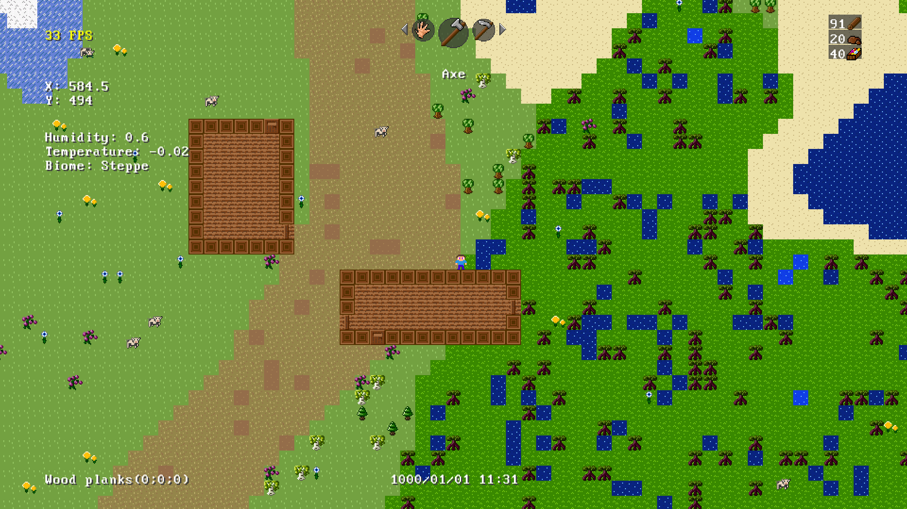

# RiverFarm

## Presentation

RiverFarm is WIP farming simulation game with inspiration from Minecraft, Minicraft, Stardew Valley and Forager.
It is made using the SFML library for C++.

## Features

 * Chunk-based rendering.
 * 7 tools (Hand, Axe, Shovel, Hoe, Scythe, Milk Pail, Seed Bag).
 * Perlin noise based world generation.
 * Basic structure generation

---

---

## Upcoming/Planned

 * Health bar.
 * Hunger bar (that'd deplete over time).
 * Player energy bar (that'd deplete as the player does actions).
 * Better inventory system.
 * Clay and derivatives (bricks). 
 * Crafting stations like the Campfire or the Kiln.
 * Saving and loading chunks.  
 * Stardew Valley style of farm buildings (pen, barn, coop, etc...).
 * Full-fledged villages with NPCs with whom you'd be able to trade and form relationships (maybe?).

## Implemented
 * Dynamic chunk generation
 * Dynamic chunk unloading 

## How to build

don't, it's a mess
